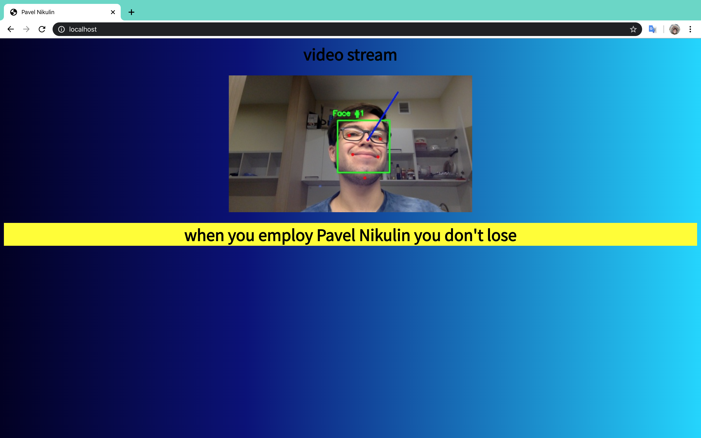

# test-task-EORA
## Pavel Nikulin
p.nikulin@innopolis.ru

tg: @indionapolis

this repository contains implementation of test task on head pose estimation on video for summer internship ata EORA.


## Getting Started

if you want to run this project locally follow instructions in Dockerfile

### Prerequisites

you need ```docker```

### Installing

just clone this directory and run ```boot.sh```

```
git clone https://github.com/indionapolis/test-task-EORA.git
```

### Running

start the project (specify youtube url ```YOUTUBE_URL=<url>``` in ```boot.sh``` to get stream from youtube or url of IP camera to get video stream from ```STREAM_URL=<url>``` in ```boot.sh``` if you don't put parameters default video will play)

it will take some time on build process
```
sh boot.sh
```

then go to [http://localhost](http://localhost) and you will be able to see processed video stream

If you have any problems with starting the project, feel free to ask me in telegram

## Built With

* [python](https://www.python.org) - programming language
* [OpenCV](https://opencv.org) - library of programming functions mainly aimed at real-time computer vision
* [dlib](http://dlib.net) - toolkit containing machine learning algorithms
* [flask](https://flask.palletsprojects.com/en/1.1.x/) - web server framework

